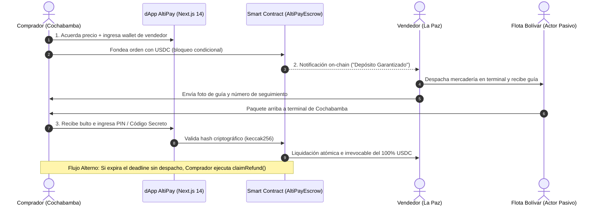

# 🚀 AltiPay Protocol
### *Infraestructura Descentralizada de Custodia Comercial y Encomiendas (PayFi)*

> **Contexto:** Buildathon Cochabamba 2026 / EAG Global Hackathon  
> **Track:** Real-World Ethereum Applications para Economías Emergentes (Devfolio)  
> **Bounties:** Pollar (Mainnet) · HSK Chain · Avalanche · Unlock Protocol · Vaquita  
> **Estado:** Especificación de Arquitectura y MVP Funcional  

---

## 1. 📌 Resumen Ejecutivo y Planteamiento del Problema

En economías emergentes como Bolivia, el comercio interdepartamental mayorista (despacho de mercadería, repuestos e insumos entre **La Paz, Santa Cruz y Cochabamba** vía transporte terrestre) enfrenta una fricción crítica: la **asimetría de confianza**.

* El **comprador** teme pagar por adelantado y ser estafado o recibir mercadería incompleta.
* El **vendedor** rehúsa despachar la mercadería en la terminal sin una confirmación irrevocable de fondos.
* Adicionalmente, el comercio depende del dinero en efectivo (riesgo físico de asaltos en terminales) y sufre por la **devaluación de la moneda local** durante los días que toma el transporte.

### 💡 La Solución: AltiPay Protocol

**AltiPay Protocol** es un motor de garantía comercial (*escrow*) programable y no custodial. Inmoviliza el pago del comprador en dólares digitales (**USDC**) dentro de un contrato inteligente y **condiciona la liberación atómica del 100% de los fondos a la entrega física de la encomienda** mediante un código secreto criptográfico.

---

## 2. ⚖️ Comparativa de Modelos de Pago

AltiPay no es una simple billetera para transferir dinero: es un **fideicomiso algorítmico sin intermediarios**.

| Característica | AltiPay Protocol | Bancos y Billeteras Fiat (Yape, Tigo Money) | Billeteras Cripto (MetaMask, Trust) |
| :--- | :--- | :--- | :--- |
| **Mecanismo de Pago** | **Condicional** (bloqueado hasta entrega) | Inmediato e irreversible | Inmediato e irreversible |
| **Riesgo de Contraparte** | **Nulo** (garantía en Smart Contract) | Alto (riesgo de no recibir el paquete) | Alto (si transfieres primero, no hay reclamo) |
| **Custodia de Fondos** | **Contrato Inteligente Neutral** | Entidad centralizada (banco/empresa) | El usuario (hasta que transfiere) |
| **Protección Cambiaria** | **Sí** (USDC/Stablecoins) | No (sufre devaluación de moneda local) | Sí |
| **Resolución de Conflictos**| **Reembolso automático por caducidad** | Burocracia bancaria o pérdida total | Inexistente |

### Diferenciadores Clave:
1. **Liquidación atada al mundo físico:** El dinero queda en un limbo seguro on-chain y solo el ingreso del código secreto de la guía de encomienda destraba los fondos.
2. **Eliminación del riesgo de confiscación:** Infraestructura no custodial. Nadie puede congelar cuentas de forma arbitraria.
3. **Fricción cambiaria resuelta:** Integración con el motor de pagos **Pollar** en mainnet para liquidaciones en USDC.
4. **Fideicomiso sin costos abusivos:** Reemplaza agentes fiduciarios y abogados por código abierto auditable.

---

## 3. 👥 Definición de Usuarios y Actores

* **El Cliente Pagador (Comprador):** Comerciante local (ej. en Cochabamba) que adquiere insumos desde otra ciudad. Fondea la orden en USDC mediante el widget de Pollar o directo al smart contract.
* **El Usuario Beneficiario (Vendedor/Proveedor):** Mayorista (ej. en La Paz) que provee la mercancía. Consulta su dashboard para verificar la etiqueta verde **"Depósito Bloqueado/Garantizado"** antes de llevar los bultos a la flota.
* **El Actor Pasivo (Empresas de Transporte / Flotas):** Flotas terrestres (ej. Flota Bolívar, El Dorado). **No interactúan con la blockchain ni necesitan wallets.** La guía física de despacho es únicamente el medio portador del dato secreto.

---

## 4. 🔄 Flujo Operativo Paso a Paso

1. **Paso 1: Creación de la Orden y Fondeo:** El comprador genera la orden y bloquea el monto exacto en USDC dentro del contrato de custodia.
2. **Paso 2: Notificación y Despacho Seguro:** El vendedor verifica el bloqueo on-chain y entrega los paquetes en la terminal de buses.
3. **Paso 3: Recepción y Liquidación Atómica:** Al recibir la carga en destino, el comprador introduce el PIN secreto en la dApp móvil. El contrato valida el hash y transfiere instantáneamente los fondos al vendedor.
4. **Paso 4: Caducidad y Reembolso (Flujo Alterno):** Si el vendedor incumple y expira el tiempo límite, el comprador retira unilateralmente el 100% de su capital.

---

## 5. 🏆 Cobertura de Bounties y Tracks Oficiales

| Patrocinador / Track | Requisito Técnico Obligatorio | Implementación en AltiPay |
| :--- | :--- | :--- |
| **Bounty Pollar** | Problema real, integración mainnet y transacción demostrable en USDC. | El comprador fondea la orden mediante `@pollar/react` en mainnet con 1 USDC real. |
| **HSK Chain Tracks** | Desplegado en HSK Mainnet o Testnet, enfocado en Payment/DeFi. | Contrato `AltiPayEscrow.sol` desplegado en HSK Testnet con faucet oficial. |
| **Bounty Avalanche** | Smart contract verificado y desplegado en Avalanche con caso de uso relevante. | Despliegue y verificación en Snowtrace (Avalanche Fuji Testnet / C-Chain). |
| **EAG Global / Devfolio** | Track: *Real-World Ethereum Applications* para economías emergentes. | Solución directa al cuello de botella logístico y cambiario en Bolivia. |
| **Unlock Protocol ($250)** | Membresía Token-Gated vía NFT ERC-721. | Llave **"AltiPay VIP Key"**: comerciantes VIP con NFT acceden a **0% comisiones**. |
| **Vaquita (100 USDC)** | Adopción, tracción y difusión Web3 en video. | Estrategia TikTok mostrando ahorro de ganancias en USDC dentro de Vaquita. |

---

## 6. 🛠️ Stack Tecnológico

### Frontend & Middleware
* **Core:** Next.js 14 (App Router) + React 18
* **Estilos:** Tailwind CSS (diseño mobile-first y componentes responsivos)
* **Web3 & Conectividad:** Wagmi + Viem + RainbowKit
* **Acelerador Base:** Scaffold-ETH 2
* **Integraciones SDK:**
  * `@pollar/react`: Botón de pago y checkout en mainnet USDC
  * `@unlock-protocol/react`: Hook para verificación de llave NFT de membresía VIP
* **Hosting:** Vercel / IPFS

### Smart Contracts & Infraestructura
* **Lenguaje:** Solidity `^0.8.20`
* **Estándares & Seguridad:** OpenZeppelin (`IERC20`, `SafeERC20`, `ReentrancyGuard`, patrón CEI)
* **Toolchain:** Foundry (`forge build`, `forge test`) y Hardhat
* **Redes:** HSK Testnet, Avalanche Fuji Testnet, Pollar Mainnet

---

## 7. 🗺️ Roadmap y Plan Go-To-Market

* **Fase 1 (Mes 1 - 2):** Despliegue en HSK Mainnet y Avalanche C-Chain. Piloto controlado con comerciantes mayoristas de **La Cancha (Cochabamba)** y alianza logística de prueba con encomiendas de **Flota Bolívar**.
* **Fase 2 (Mes 3 - 6):** Identidad y reputación crediticia on-chain (Credit Score descentralizado). Acceso a microcréditos de capital de trabajo DeFi para comerciantes con volumen verificado.
* **Fase 3 (Mes 7 - 12):** Agentes autónomos de IA integrados a los sistemas de GPS y guías de las empresas de transporte para liquidar automáticamente el escrow sin intervención manual.

---

## 8. 📚 Índice de Documentación de Ingeniería

Toda la especificación técnica completa se encuentra disponible en la carpeta [`docs/`](./docs):

1. 📄 [**PRD.md**](./docs/PRD.md): Requisitos de producto, métricas de éxito, roles, matriz de riesgos y filtros anti-prohibición.
2. 🗄️ [**DATA_MODEL.md**](./docs/DATA_MODEL.md): Modelo de datos, structs on-chain, schemas de base de datos e invariantes criptográficos.
3. 🎨 [**DESIGN.md**](./docs/DESIGN.md): Sistema de diseño visual, tokens CSS, componentes C4 y diagramas de secuencia.
4. 🧪 [**ACCEPTANCE_SCENARIOS.md**](./docs/ACCEPTANCE_SCENARIOS.md): Escenarios de prueba BDD / Gherkin (Happy paths, cancelaciones, disputas y reembolsos).
5. ⚙️ [**BACKEND_ARCHITECTURE.md**](./docs/BACKEND_ARCHITECTURE.md): Arquitectura de Smart Contracts (`AltiPayEscrow.sol`), modelo de gas, análisis STRIDE y scripts de despliegue.
6. 💻 [**FRONTEND_ARCHITECTURE.md**](./docs/FRONTEND_ARCHITECTURE.md): Arquitectura Next.js 14, hooks Web3, widgets de Pollar y Unlock Protocol, y wireframes de interfaz.
7. 👥 [**DISTRIBUCION_EQUIPO.md**](./DISTRIBUCION_EQUIPO.md): Plan de trabajo, división en 4 roles, matriz RACI, cronograma de sprints y asignación de bounties.

---

## 📄 Licencia

Este proyecto está bajo la licencia **MIT**. Código abierto para el ecosistema de finanzas descentralizadas y comercio justo en Latinoamérica.