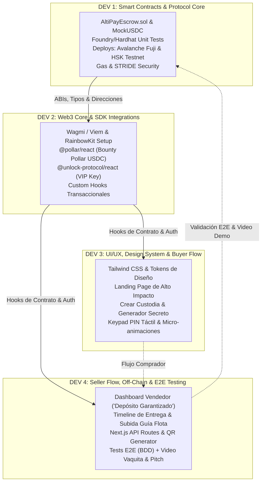

# 👥 AltiPay Protocol — Plan de Distribución Técnica (4 Desarrolladores)

> **Contexto:** Buildathon Cochabamba 2026 / EAG Global Hackathon  
> **Track:** Real-World Ethereum Applications para Economías Emergentes (Devfolio)  
> **Bounties:** Pollar (Mainnet) · HSK Chain · Avalanche · Unlock Protocol · Vaquita  
> **Perfil del Equipo:** **4 Desarrolladores de Software (100% Código)**  
> **Nota sobre Exposición:** La preparación del Pitch, Video Vaquita y Demo Day se asigna como **responsabilidad secundaria al Dev 4** (quien valida la app de punta a punta en los tests E2E), sin sacrificar su carga de desarrollo técnico.

---

## 🧭 1. Resumen Ejecutivo de la Arquitectura de Desarrollo

El sistema AltiPay se divide en **4 módulos técnicos de ingeniería**, permitiendo que cada desarrollador tenga ownership completo de una parte del stack:



---

## 📋 2. Tabla de Asignación Rápida de Desarrolladores

| # | Desarrollador | Módulos Técnicos Principales | Stack / Tecnologías | Bounties Asignados |
|---|---|---|---|---|
| **DEV 1** | **Smart Contracts & Blockchain Protocol** | `AltiPayEscrow.sol`, `MockUSDC.sol`, scripts de despliegue, optimización de gas y seguridad. | Solidity `^0.8.20`, Foundry / Hardhat, OpenZeppelin | **Avalanche** (Snowtrace), **HSK Chain** |
| **DEV 2** | **Web3 Core & Patrocinadores SDK** | Conectividad Web3, integración de checkout Pollar y token-gating de Unlock Protocol, custom hooks. | Next.js 14, Wagmi, Viem, RainbowKit, `@pollar/react`, `@unlock-protocol/react` | **Pollar Mainnet**, **Unlock Protocol** |
| **DEV 3** | **Frontend UI/UX & Flujo Comprador (Buyer)** | Landing page, sistema de diseño, vista de creación de orden, generador de PIN y teclado táctil. | Tailwind CSS, React 18, Framer Motion / Lucide Icons | **UX / Mobile-First Usability** |
| **DEV 4** | **Dashboard Vendedor, Off-Chain & E2E Testing** | Dashboard de vendedor, timeline de rastreo, API routes, QR codes, tests E2E + *(Pitch & Video Vaquita)*. | Next.js App Router (Server/Client), LocalStorage/IndexDB, Vitest/Playwright | **Bounty Vaquita**, **Devfolio Submisión** |

---

## 🛠️ 3. Especificación Detallada por Desarrollador

---

### 🧑‍💻 DESARROLLADOR 1: Smart Contracts & Blockchain Protocol Luis_Sandoval
> **Guía Técnica Completa y Código:** 📄 [`docs/DEV_1_LUIS_SANDOVAL.md`](./DEV_1_LUIS_SANDOVAL.md)  
> **Enfoque:** Lógica on-chain, seguridad criptográfica, pruebas unitarias y despliegue multichain.

#### 📁 Archivos bajo su responsabilidad:
* `contracts/AltiPayEscrow.sol` (Contrato principal de custodia condicional)
* `contracts/MockUSDC.sol` (Token ERC-20 para pruebas en testnet con faucet `mint`)
* `contracts/interfaces/IUnlockLock.sol` (Interfaz de integración con Unlock Protocol)
* `test/AltiPayEscrow.t.sol` (Suite completa de tests unitarios en Foundry o Hardhat)
* `scripts/Deploy.s.sol` / `scripts/deploy.ts` (Scripts de despliegue automatizado y verificación)
* `contracts/deployedAddresses.json` (Exportación de direcciones y ABIs compilados)

#### 🎯 Tareas de Código:
1. **Lógica de Custodia (`AltiPayEscrow.sol`):**
   * Estructura de datos `Order`: `buyer`, `seller`, `token`, `amount`, `secretHash`, `deadline`, `status`, `trackingInfo`.
   * Función `createOrder(...)`: Transferencia segura de fondos (`SafeERC20`) y registro del hash criptográfico (`keccak256`).
   * Función `confirmDispatch(...)`: Registro de la guía y número de despacho por el vendedor.
   * Función `confirmDeliveryWithSecret(...)`: Verificación atómica del secreto y transferencia del 100% de los fondos al vendedor.
   * Función `claimRefund(...)`: Retiro unilateral del comprador si vence el plazo (`block.timestamp > deadline`) sin despacho.
   * Integración on-chain con Unlock Protocol: verificación de `vipLock.getHasValidKey(buyer)` para eximir la comisión del protocolo (0% fee).
   * Protección contra reentrancy (`ReentrancyGuard`) y patrón CEI (*Checks-Effects-Interactions*).
2. **Suite de Pruebas Automatizadas:**
   * Crear tests para todos los casos de `docs/ACCEPTANCE_SCENARIOS.md`: happy path, doble retiro, hash inválido, cancelación no autorizada y expiración de tiempo.
3. **Despliegues y Verificación en Redes:**
   * Despliegue y verificación de código en **Avalanche Fuji Testnet** (Snowtrace) ➔ *Bounty Avalanche*.
   * Despliegue y verificación en **HSK Testnet** ➔ *Bounty HSK*.
   * Publicar los ABIs y las direcciones en el repositorio para que DEV 2 los consuma.

---

### ⚡ DESARROLLADOR 2: Web3 Core & SDK Integrations Jorge_Ayala
> **Guía Técnica Completa y Tickets:** 📄 [`docs/DEV_2_JORGE_AYALA.md`](./DEV_2_JORGE_AYALA.md)  
> **Enfoque:** Infraestructura Web3 en el cliente, integración de los SDKs de patrocinadores y gestión de transacciones.

#### 📁 Archivos bajo su responsabilidad:
* `config/wagmi.ts` (Configuración de chains: Avalanche Fuji, HSK Testnet, Pollar Mainnet)
* `components/web3/Web3Provider.tsx` (Provider de RainbowKit y Wagmi v2)
* `components/bounties/PollarCheckoutButton.tsx` (Integración SDK `@pollar/react`)
* `hooks/useUnlockVIP.ts` (Integración hook `@unlock-protocol/react` para detectar VIP Key)
* `hooks/useAltiPayEscrow.ts` (Hooks personalizados de lectura y escritura del contrato)
* `hooks/useUSDCApproval.ts` (Hook para flujo de `approve` ERC-20 de USDC)
* `services/transactionHandler.ts` (Manejo de estados de transacción: loading, confirmed, reverted)

#### 🎯 Tareas de Código:
1. **Configuración de Redes y Conectividad:**
   * Configurar Wagmi + Viem con soporte multi-chain para Avalanche Fuji (Chain ID `43113`) y HSK Testnet (Chain ID `177`).
   * Implementar botón de conexión de billetera (RainbowKit) con detección de red errónea y switcheo automático.
2. **Integración SDK Pollar (Bounty Pollar Mainnet):**
   * Integrar `@pollar/react` para permitir el checkout y fondeo directo de la orden con USDC en mainnet.
   * Conectar callbacks de confirmación de pago con la dApp.
3. **Integración SDK Unlock Protocol (Bounty Unlock):**
   * Conectar con el lock del contrato VIP de Unlock Protocol.
   * Crear el hook `useUnlockVIP()` que retorne `{ isVIP: boolean, discountApplied: boolean }`.
4. **Capa de Abstracción de Contratos (Hooks):**
   * Crear hooks limpios para que DEV 3 y DEV 4 los consuman sin tocar lógica compleja de Wagmi:
     * `useCreateOrder({ seller, amount, secretHash, deadline })`
     * `useConfirmDispatch({ orderId, trackingInfo })`
     * `useReleasePayment({ orderId, secretCode })`
     * `useClaimRefund({ orderId })`
     * `useOrderDetails(orderId)`
   * Gestión de estados de carga (toasts de notificación, hashes en el explorador, confirmación de bloques).

---

### 🎨 DESARROLLADOR 3: UI/UX, Design System & Buyer Flow Eddy_Galvan
> **Enfoque:** Experiencia visual, diseño mobile-first, maquetación del landing page y el flujo completo del comprador.

#### 📁 Archivos bajo su responsabilidad:
* `tailwind.config.js` y `app/globals.css` (Implementación de tokens de `docs/DESIGN.md`)
* `components/ui/*` (Button, Input, Card, Modal, Badge, Tooltip, Alert)
* `components/layout/Navbar.tsx` & `components/layout/Footer.tsx`
* `app/page.tsx` (Landing Page comercial AltiPay)
* `app/create/page.tsx` (Página de creación y fondeo de orden de custodia)
* `components/buyer/SecretGeneratorModal.tsx` (Generador del código secreto / PIN con hash `keccak256`)
* `components/buyer/KeypadReleaseModal.tsx` (Teclado numérico táctil mobile-first para ingresar PIN)

#### 🎯 Tareas de Código:
1. **Sistema de Diseño y Tokens (`docs/DESIGN.md`):**
   * Configurar paleta AltiPay: Indigo primario (`#6366F1`), Verde éxito (`#10B981` para depósitos garantizados), Slate oscuro para modo nocturno.
   * Implementar fuentes Inter / Outfit y micro-componentes reutilizables.
2. **Landing Page (`/`):**
   * Hero section de impacto con narrativa boliviana: "Comercio seguro entre La Paz, Cochabamba y Santa Cruz".
   * Diagrama interactivo de 3 pasos (Fondeo ➔ Despacho en Flota ➔ Liberación con PIN).
   * Comparativa visual interactiva vs Bancos / Tigo Money / Efectivo.
   * Métricas y calculadora de ahorro en comisiones con membresía VIP Unlock.
3. **Flujo del Comprador (`/create`):**
   * Formulario de creación de orden con cálculo automático del fee (o 0% si DEV 2 reporta `isVIP: true`).
   * Módulo de generación de secreto: crea un PIN aleatorio de 6 dígitos, calcula el hash en cliente y muestra modal de advertencia ("No compartas este código hasta revisar tu mercadería en la terminal").
4. **Componente de Liberación con Teclado Táctil:**
   * Keypad táctil estilizado para celulares para introducir el PIN y llamar a `confirmDeliveryWithSecret`.
   * Animaciones de éxito (confetti, checkmarks animados) al liberar los fondos.

---

### 📦 DESARROLLADOR 4: Seller Dashboard, Off-Chain Services & E2E Testing (+ Pitch/Video) Joseca
> **Enfoque:** Flujo del vendedor, trazabilidad física de encomiendas, capa off-chain, pruebas integradas E2E y coordinación del pitch.

#### 📁 Archivos bajo su responsabilidad:
* `app/seller/page.tsx` (Dashboard de órdenes recibidas por el vendedor)
* `app/order/[id]/page.tsx` (Página de seguimiento y timeline de la encomienda)
* `components/seller/DispatchModal.tsx` (Formulario de despacho con número de guía de transporte)
* `components/seller/GuiaUploader.tsx` (Subida y vista previa de foto de la guía física de encomienda)
* `components/common/OrderTimeline.tsx` (Línea de tiempo interactiva: Creado ➔ Despachado ➔ Entregado)
* `app/api/orders/[id]/route.ts` (API route para metadatos off-chain o shareable links)
* `test/e2e/escrow-flow.test.ts` (Suite de pruebas de integración basada en `docs/ACCEPTANCE_SCENARIOS.md`)
* *(Responsabilidad secundaria de demo)*: Video TikTok Vaquita y Slides de Presentación.

#### 🎯 Tareas de Código:
1. **Dashboard del Vendedor (`/seller`):**
   * Lista de órdenes filtradas por la wallet del vendedor.
   * Tarjeta visual destacada en verde: **"Depósito Bloqueado y Garantizado"** con monto exacto en USDC.
   * Modal de despacho: permite al vendedor ingresar número de guía (ej. Flota Bolívar #84920) y subir foto simulada de la guía.
2. **Timeline de Encomienda & Vista de Seguimiento (`/order/[id]`):**
   * Componente visual con stepper de 4 fases (1. Custodia Creada ➔ 2. En Tránsito Terrestre ➔ 3. Arribo a Terminal ➔ 4. Liquidado).
   * Generador de código QR y link directo para compartir por WhatsApp al comprador o chofer.
3. **Pruebas de Integración E2E (BDD):**
   * Automatizar o verificar de punta a punta los escenarios de `docs/ACCEPTANCE_SCENARIOS.md`.
   * Validar que la interfaz responda correctamente cuando la transacción esté pendiente, exitosa o falle.
4. **Coordinación de Pitch y Video (Tarea Complementaria):**
   * Como DEV 4 domina el flujo completo de vendedor a comprador y tiene los datos de prueba listos, es el indicado natural para:
     * Grabar el video corto vertical (formato TikTok) cumpliendo el **Bounty Vaquita (100 USDC)**.
     * Armar la estructura del Pitch Deck en Google Slides / Canva con capturas reales del sistema.
     * Coordinar la entrega del formulario en Devfolio.

---

## 🔄 4. Matriz de Dependencias e Intersecciones de Código (Handoffs)

Para programar en paralelo sin que nadie se quede esperando:

```
┌────────────────────────────────────────────────────────────────────────────────────────┐
│                          PROTOCOLO DE INTEGRACIÓN CONTINUA                             │
│                                                                                        │
│  [DEV 1] ──> Provee interfaces ABI y tipos TypeScript en las primeras 3 horas.        │
│  [DEV 2] ──> Mockea llamadas mientras DEV 1 despliega en testnet.                      │
│  [DEV 3] ──> Desarrolla vistas con dummy props y estados locales de React.             │
│  [DEV 4] ──> Maqueta dashboard del vendedor con mock orders en JSON.                  │
│                                                                                        │
│  HITO DE CONVERGENCIA (Hora 24): Se ensamblan Hooks reales en todas las pantallas.    │
└────────────────────────────────────────────────────────────────────────────────────────┘
```

| Punto de Conexión | Quien Desarrolla | Quien Consume | Archivo / Contrato de Interfaz | Estrategia de Desacoplamiento (Mock) |
|---|---|---|---|---|
| **ABI y Tipos de Contrato** | DEV 1 | DEV 2 | `contracts/AltiPayEscrow.sol` ➔ `types/contracts.ts` | DEV 2 define tipos provisionales basados en `docs/BACKEND_ARCHITECTURE.md`. |
| **Hooks de Smart Contract** | DEV 2 | DEV 3 & DEV 4 | `hooks/useAltiPayEscrow.ts` | DEV 3 y 4 usan funciones dummy que retornan `loading: false, isSuccess: true` mientras tanto. |
| **Componentes UI Base** | DEV 3 | DEV 4 | `components/ui/*` | DEV 4 usa HTML básico con clases Tailwind provisorias hasta importar los componentes compartidos. |
| **Datos de Prueba E2E** | DEV 4 | DEV 1, 2, 3 | `test/mockData.json` | Wallets de prueba con fondos en MockUSDC listos para pruebas en Avalanche y HSK. |

---

## ⏱️ 5. Cronograma de Trabajo por Sprints (Hackathon 48 Horas)

```mermaid
gantt
    title Cronograma de Ejecución AltiPay (4 Desarrolladores)
    dateFormat X
    axisFormat %H h

    section DEV 1 (Smart Contracts)
    AltiPayEscrow.sol & MockUSDC  :active, 0, 8
    Foundry Tests & Gas Opt       :8, 18
    Deploy Avalanche & HSK        :18, 28
    Verificación Snowtrace/HSK    :28, 36
    Soporte Técnico & Ajustes     :36, 48

    section DEV 2 (Web3 & SDKs)
    Wagmi + RainbowKit Setup      :active, 0, 8
    Hooks Escrow & Transacciones  :8, 20
    Integración Pollar & Unlock   :20, 32
    Conexión con Vistas UI        :32, 40
    Pruebas E2E en Testnet        :40, 48

    section DEV 3 (Buyer UI/UX)
    Design Tokens & Layout        :active, 0, 8
    Landing Page Comercial        :8, 20
    Crear Orden & Generador PIN   :20, 32
    Keypad PIN Táctil & Animación :32, 40
    Pulido Mobile-First           :40, 48

    section DEV 4 (Seller & E2E)
    Dashboard Vendedor & Guía     :active, 0, 10
    Timeline & Links Compartibles :10, 22
    Suite de Pruebas E2E (BDD)    :22, 34
    Grabación Video Vaquita (Bounty):34, 40
    Pitch Deck & Devfolio Submit  :40, 48
```



---

## 📊 6. Matriz RACI Técnica

* **R (Responsible):** Desarrollador que escribe el código.
* **A (Accountable):** Responsable de que funcione sin bugs.
* **C (Consulted):** Apoya con definiciones de interfaces o APIs.
* **I (Informed):** Recibe la funcionalidad terminada para integrarla.

| Módulo / Entregable | DEV 1 (Solidity) | DEV 2 (Web3/SDK) | DEV 3 (Buyer UI) | DEV 4 (Seller/E2E) |
|---|:---:|:---:|:---:|:---:|
| `AltiPayEscrow.sol` y `MockUSDC.sol` | **R / A** | C | I | C |
| Tests Unitarios Foundry / Hardhat | **R / A** | I | I | C |
| Despliegue en Avalanche Fuji & HSK | **R / A** | C | I | I |
| Configuración Wagmi & Providers | C | **R / A** | I | I |
| Botón Checkout Pollar Mainnet (`@pollar/react`) | C | **R / A** | C | I |
| Detección VIP Unlock Protocol | C | **R / A** | C | I |
| Landing Page & Design Tokens | I | I | **R / A** | C |
| Formulario Crear Custodia & Generador PIN | I | C | **R / A** | I |
| Teclado Táctil de Liberación de PIN | I | C | **R / A** | C |
| Dashboard del Vendedor & Subida de Guía | I | C | C | **R / A** |
| Timeline de Rastreo & Link Compartible | I | C | C | **R / A** |
| Pruebas E2E Multichain (BDD Scenarios) | C | C | C | **R / A** |
| Video TikTok Bounty Vaquita & Demo | I | I | C | **R / A** |
| Submisión Devfolio & Documentación | C | C | C | **R / A** |

---

## 🌿 7. Estrategia de Ramas Git (Clean Code Flow)

```
main (Entrega final para evaluación de Devfolio)
 │
 └── develop (Integración continua del equipo)
      │
      ├── feature/sc-contracts-core        <── DEV 1
      ├── feature/web3-sdk-integrations    <── DEV 2
      ├── feature/ui-buyer-flow            <── DEV 3
      └── feature/ui-seller-offchain       <── DEV 4
```

### Reglas de Git para los 4 Desarrolladores:
1. Crear PRs siempre dirigidos hacia `develop`.
2. Para probar integraciones, fusionar `develop` dentro de su rama de feature antes de abrir un PR.
3. El archivo `deployedAddresses.json` solo lo actualiza DEV 1 tras realizar un despliegue oficial.
4. Mantener la suite de tests pasando (`npm run build` y `forge test`) antes de autorizar cualquier merge.

---

## 🏆 8. Checklist de Bounties Asignados

* [ ] **Avalanche Fuji (Snowtrace):** *(DEV 1)* Contrato verificado con código público en Snowtrace.
* [ ] **HSK Testnet (HashKey):** *(DEV 1)* Contrato desplegado e interactuado en la red HSK.
* [ ] **Pollar Mainnet USDC:** *(DEV 2)* Flujo de pago y fondeo con `@pollar/react` en mainnet.
* [ ] **Unlock Protocol VIP Key:** *(DEV 2)* Hook de verificación de NFT que otorga 0% fee al comerciante.
* [ ] **Vaquita Video Bounty (100 USDC):** *(DEV 4)* Video dinámico en formato TikTok/Reels publicado en redes.
* [ ] **Devfolio Track Real-World Ethereum:** *(DEV 4 + Todo el Equipo)* Repositorio público, README completo con links verificados y demo funcional.
