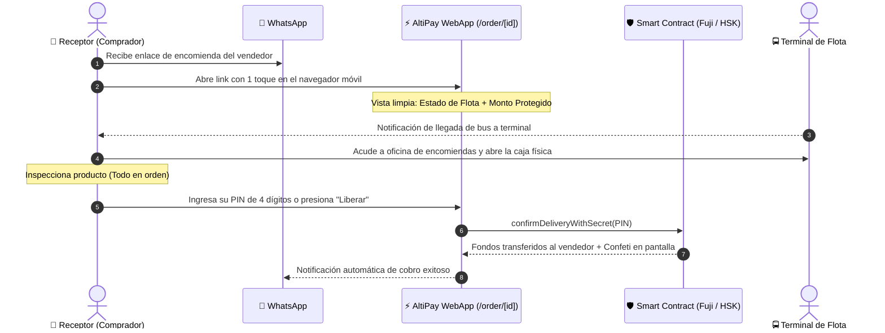

# 📱 AltiPay Protocol — Experiencia del Receptor (Consignatario y Comprador)
## Arquitectura de Producto, UX Mobile-First y Protección del Cliente en Destino

> **Documento:** Blueprint de Producto y UX del Receptor  
> **Versión:** 1.0.0 — Hackathon Special Edition  
> **Fecha:** Septiembre 2026  
> **Enfoque:** Resolver la asimetría entre el comerciante mayorista (Dashboard de escritorio) y la persona que recibe la mercadería (Móvil en terminal de flotas).

---

## 🧭 1. El Gran Dilema de Usabilidad

### 1.1 La Asimetría de los Dos Extremos
En los sistemas de pago tradicionales o plataformas B2B existe una brecha crítica:
* **El Mayorista / Empresario:** Trabaja desde una oficina o depósito en La Paz o Santa Cruz, frente a una laptop, con tiempo para monitorear balances, analíticas y múltiples transacciones en un dashboard completo.
* **La Persona que Recibe (El Receptor):** Es un comerciante minorista en La Cancha (Cochabamba), Los Pozos (Santa Cruz) o un comprador final. **Está en la calle o en la terminal de buses**, con un celular en la mano, conexión 4G fluctuante, ruido ambiental y prisa por retirar su encomienda.

```
┌────────────────────────────────────────┐       ┌────────────────────────────────────────┐
│         MAYORISTA (ORIGEN)             │       │          RECEPTOR (DESTINO)            │
│  • En oficina / Depósito               │       │  • En la terminal de buses / Mercado   │
│  • Laptop con pantalla grande          │  VS   │  • Teléfono móvil (Android / iOS)      │
│  • Necesita métricas y balances        │       │  • Necesita: Rastrear, Verificar y PIN │
│  • Usa Dashboard Administrativo        │       │  • CERO FRICCIÓN, 100% DIRECTO         │
└────────────────────────────────────────┘       └────────────────────────────────────────┘
```

Si obligamos al receptor a navegar por un dashboard financiero complejo con gráficos y menús corporativos para simplemente retirar su caja de repuestos en la terminal de buses, **el producto fracasa en el mundo real**.

---

## 👥 2. Arquetipos del Receptor: ¿Quién recibe en Bolivia?

| Arquetipo | Perfil | Ubicación Típica | Prioridad Clave |
|---|---|---|---|
| **Comerciante Minorista** | Dueño de puesto o tienda en mercado popular (repuestos, telas, celulares). | La Cancha (Cochabamba), Uyustus (La Paz), Barrio Lindo (Santa Cruz). | Saber que su dinero no se perdió y que la flota ya llegó para ir a recogerla. |
| **Profesional / PYME** | Fotógrafo, arquitecto, programador que encarga laptops, cámaras o herramientas caras. | Zona Sur (La Paz), Equipetrol (Santa Cruz), Cala Cala (Cochabamba). | Inspeccionar que el equipo no esté golpeado antes de soltar un solo dólar. |
| **Comprador Ocasional** | Persona particular comprando insumos a otra ciudad por Marketplace o WhatsApp. | Cualquier departamento conectado por flota. | Seguridad absoluta contra estafas por adelantado. |

---

## 🚀 3. El Viaje del Receptor (Customer Journey Paso a Paso)

El receptor interactúa con AltiPay a través de un flujo ultra-simplificado de **3 toques en su teléfono**:



### Paso 1: Recepción del Enlace por WhatsApp
El receptor no necesita buscar la web en Google ni descargar una app pesada de la Play Store. Recibe un mensaje directo en WhatsApp:
```text
🇧🇴 AltiPay — Encomienda Protegida
📦 Producto: MacBook Pro M3 (16GB RAM)
🚍 Transporte: Flota Bolívar — Guía #40921
💰 Custodia: $1,850.00 USDC Garantizados
🔗 Rastrear tu envío: https://altipay.app/order/ALT-8924

Tu dinero está seguro en smart contract. Solo entrega el PIN al verificar tu caja en el terminal.
```

### Paso 2: La Pantalla Móvil del Receptor (`/order/[id]`)
Al abrir el enlace, el receptor ve una pantalla limpia y sin distracciones:
1. **Semáforo de Seguridad:**
   * 🟢 *"Tus fondos están protegidos en Smart Contract. El vendedor aún NO ha cobrado."*
2. **Stepper de Flota Interdepartamental:**
   * `[✓] Pago asegurado en custodia` ➔ `[🚍] En tránsito por Flota Bolívar` ➔ `[ ] Listo para entrega con PIN`.
3. **Tarjeta de la Encomienda:**
   * Nombre de la flota, número de guía física y foto del comprobante de despacho.
4. **Recordatorio del PIN Secreto:**
   * Un recuadro destacado con su código PIN personal (ej. `4092`).

### Paso 3: Llegada a la Terminal y Verificación Física
El receptor llega a la oficina de encomiendas de la flota (ej. Terminal de Buses de Cochabamba):
1. Presenta su cédula de identidad física al encargado de la flota para retirar el bulto.
2. Abre la caja frente al mostrador y verifica que la mercadería corresponda exactamente a lo comprado.

### Paso 4: Liberación Atómica del Dinero
Una vez conforme:
* Abre la página en su celular.
* Introduce el PIN en el teclado táctil de pantalla grande.
* Presiona **"Confirmar recepción y liberar fondos"**.
* En menos de 2 segundos (gracias a la finalidad instantánea de Avalanche Fuji / HSK), la transacción se liquida, la pantalla se llena de **confeti verde** y el vendedor recibe el 100% de sus USDC de inmediato en su billetera.

---

## 🛡️ 4. ¿Qué pasa si las cosas salen mal? (Protocolo de Protección)

El mayor valor de AltiPay para el receptor no es cuando todo sale bien, sino **cuando el vendedor o la flota fallan**:

```
                              PROBLEMA EN EL DESTINO
                                        │
             ┌──────────────────────────┴──────────────────────────┐
             ▼                                                     ▼
     ESCENARIO A: DAÑO FÍSICO                              ESCENARIO B: NO LLEGÓ
• La caja llegó rota o incompleta.                     • Pasaron 72h y la flota no arribó.
• El receptor NO da el PIN.                           • El vendedor mintió con la guía.
• Presiona "Pausar / Abrir Disputa".                  • El deadline vence en el contrato.
• Fondos quedan congelados para revisión.             • Receptor presiona "Reclamar Reembolso".
• El mediador solicita acta de reclamo.               • 100% de los USDC regresan a su wallet.
```

### Escenario A: La mercadería llegó rota o faltan unidades
1. El receptor **NUNCA entrega el PIN**. Sin el PIN, el vendedor es matemáticamente incapaz de retirar un solo centavo del contrato inteligente.
2. En la pantalla de la orden presiona **"Reportar problema / Solicitar Mediación"**.
3. Sube una fotografía de la mercadería dañada y del reclamo sellado por la flota.
4. El mediador del protocolo revisa la evidencia física y puede emitir un reembolso total o una liquidación parcial.

### Escenario B: El vendedor nunca despachó o el bus se extravió
1. Al momento de crear la orden, se estipuló un plazo máximo (ej. 72 horas).
2. Si el plazo expira sin que la entrega haya sido confirmada con PIN, la interfaz del receptor activa automáticamente el botón:
   * **`Reclamar Reembolso Inmediato (100% USDC)`**.
3. Al presionarlo, el smart contract ejecuta `claimRefund()` y devuelve los fondos a la billetera del comprador de forma unilateral, sin pedir permiso al vendedor ni pasar por burocracia bancaria.

---

## 🎨 5. Componentes de UI Diseñados Exclusivamente para el Receptor

Para satisfacer la necesidad de simplicidad del receptor, AltiPay cuenta con componentes mobile-first especializados:

### 1. `KeypadReleaseModal` (Teclado Numérico Táctil)
* Un teclado numérico táctil en pantalla optimizado para una sola mano en celulares.
* Botones grandes con respuesta visual de rebote.
* Oculta el PIN hasta que el usuario está listo para ingresarlo en el mostrador de la terminal.

### 2. `QuickInspectionChecklist` (Guía de Inspección Rápida)
* Antes del botón de PIN, la app muestra 3 checkboxes simples:
  * [ ] *Caja sellada sin signos de apertura previa.*
  * [ ] *Número de serie / modelo coincide con lo acordado.*
  * [ ] *Encienden o funcionan los componentes principales.*
* Solo al marcar los puntos se habilita el desbloqueo del PIN, educando al comerciante popular en buenas prácticas de recepción.

### 3. `OfflineSafeCard` (Modo Terminal sin Cobertura)
* En muchas terminales de buses subterráneas o con techo de tinglado metálico, la señal 4G cae a cero.
* AltiPay guarda en el `localStorage` del navegador el ID de la orden y el PIN criptográfico.
* El receptor puede abrir la web incluso sin señal de datos para leer el PIN y dictárselo verbalmente al chofer o mostrarle el código QR para que lo procese en cuanto haya red.

---

## 📊 6. Comparativa de Interfaces: Mayorista vs Receptor

| Característica | Dashboard del Mayorista (`/dashboard`) | Portal del Receptor (`/order/[id]`) |
|---|---|---|
| **Dispositivo Objetivo** | Computadora de escritorio / Tablet | Teléfono inteligente (Mobile-first) |
| **Complejidad Visual** | Completa: Gráficos, métricas, historial multichain | Mínima: Estado de bulto, tracking de flota y botón de PIN |
| **Tiempo de Interacción** | Sesiones de 10 a 30 minutos de gestión | Sesiones relámpago de 30 segundos en el terminal |
| **Acción Principal** | Bloquear capital o emitir facturas/despachos | Confirmar recepción física y destrabar el dinero |
| **Nivel Técnico Exigido** | Medio (Manejo de billeteras Web3 y balances) | Casi nulo (Solo necesita abrir un enlace y teclear un PIN) |

---

## 🏆 7. Por qué esta experiencia enamora a los Jurados del Hackathon

Cuando los jueces evalúan proyectos de Web3 para economías emergentes, suelen hacer la pregunta del millón:  
> *"¿Cómo va a usar esto una señora que vende ropa en el mercado de Cochabamba si apenas sabe usar WhatsApp?"*

AltiPay responde a esa pregunta con contundencia:
1. **La señora NO necesita entender qué es un Smart Contract ni qué es Avalanche Fuji:** Ella solo recibe un enlace por WhatsApp de su proveedor de La Paz.
2. **La interfaz habla su mismo idioma:** Le muestra el nombre de la *Flota Bolívar*, la foto de la guía de encomienda que conoce de toda la vida y un semáforo verde que le dice *"Tu dinero no se mueve hasta que tengas tu caja en la mano"*.
3. **El PIN emula la vida real:** Funciona exactamente como el código de retiro de una encomienda o el PIN de un cajero automático.

Esta empatía de producto cierra la brecha entre la tecnología blockchain más avanzada del mundo y la realidad cotidiana del comercio popular boliviano.
