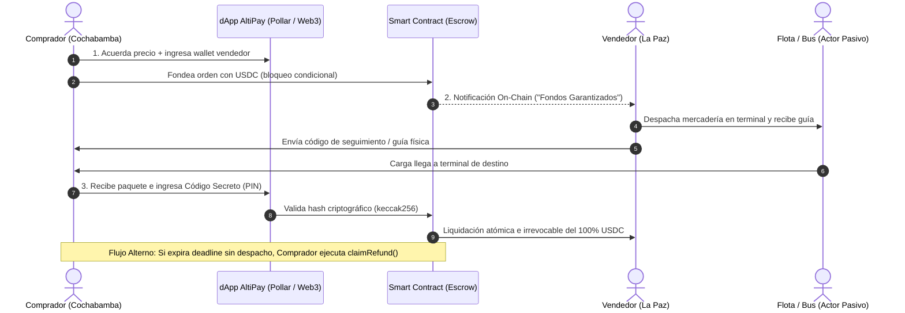

# AltiPay Protocol — Product Requirements Document (PRD)

> **Versión:** 1.0.0  
> **Estado:** Especificación MVP — Buildathon Cochabamba 2026 / EAG Global Hackathon  
> **Fecha:** 2026-09-11  
> **Autores:** Equipo AltiPay  

---

## 1. Visión del Producto

**AltiPay Protocol** es una infraestructura PayFi no custodial que resuelve la asimetría de confianza en el comercio mayorista interdepartamental boliviano. Mediante contratos inteligentes de custodia condicional (escrow) sobre stablecoins, AltiPay elimina el riesgo bilateral entre comprador y vendedor en operaciones de encomienda terrestre.

> **IMPORTANTE:** AltiPay NO es un split payment, marketplace de NFTs, plataforma de donaciones, ni clon de Uber/Airbnb. Es estrictamente una **capa de liquidación financiera** (Payment Engine) sobre redes de logística física ya existentes.

---

## 2. Planteamiento del Problema

### 2.1 Contexto del Mercado

El comercio interdepartamental mayorista en Bolivia (La Paz ↔ Santa Cruz ↔ Cochabamba) mueve millones de bolivianos semanales en mercadería, repuestos e insumos vía transporte terrestre. Este ecosistema padece de:

| Problema | Impacto |
|----------|---------|
| **Asimetría de confianza** | El comprador teme pagar sin recibir; el vendedor teme despachar sin cobrar. |
| **Dependencia del efectivo** | Exposición a robos en terminales y oficinas de encomienda. |
| **Devaluación constante** | El crédito comercial en moneda local pierde valor durante el tránsito (3-7 días). |
| **Sin trazabilidad financiera** | Disputas irresolubles por falta de evidencia del pago o entrega. |
| **Informalidad** | ~68% de las transacciones carecen de respaldo contractual alguno. |

### 2.2 Dilema del Comerciante (Pain Point Central)

```
Vendedor (La Paz): "No despacho la carga si no veo el dinero primero."
Comprador (Cochabamba): "No pago si no recibo la mercadería completa."
→ Punto muerto comercial. Operaciones perdidas o ejecutadas con riesgo.
```

### 2.3 Solución Propuesta

AltiPay actúa como un **tercero de confianza algorítmico** que:

1. Inmoviliza el pago del comprador en USDC dentro de un contrato inteligente.
2. Certifica on-chain que los fondos están disponibles para el vendedor.
3. Libera los fondos solo cuando el comprador valida la recepción con un **código secreto criptográfico**.
4. Reembolsa al comprador si el vendedor no despacha dentro del tiempo límite.

### 2.4 Comparativa de Modelos de Pago

AltiPay no es una simple billetera para guardar o enviar dinero; es un motor de garantía comercial (*escrow*) programable. Mientras las aplicaciones financieras tradicionales ejecutan transferencias inmediatas basadas en confianza ciega, AltiPay inmoviliza el capital y condiciona la liberación del pago a la entrega física de la mercadería.

| Característica | AltiPay Protocol | Bancos y Billeteras Fiat (Yape, Tigo Money) | Billeteras Cripto (MetaMask, Trust) |
| :---- | :---- | :---- | :---- |
| **Mecanismo de Pago** | Condicional (bloqueado hasta entrega) | Inmediato e irreversible | Inmediato e irreversible |
| **Riesgo de Contraparte** | Nulo (garantía en Smart Contract) | Alto (riesgo de no recibir el paquete) | Alto (si transfieres primero, no hay reclamo) |
| **Custodia de los Fondos** | Contrato Inteligente Neutral | Entidad centralizada (banco/empresa) | El usuario (hasta que transfiere) |
| **Protección Cambiaria** | Sí (USDC/Stablecoins) | No (sufre devaluación de moneda local) | Sí |
| **Resolución de Conflictos** | Reembolso automático por caducidad | Burocracia bancaria o pérdida total | Inexistente |

### 2.5 Diferenciadores Técnicos y Comerciales

* **Liquidación atada al mundo físico:** A diferencia de una transferencia bancaria o un envío simple por MetaMask, AltiPay no le entrega el dinero al vendedor al presionar "Enviar". El dinero queda en un limbo seguro (on-chain) y solo el ingreso del código secreto de la guía de encomienda destraba los fondos.
* **Eliminación del riesgo de confiscación:** Las billeteras virtuales corporativas pueden congelar cuentas, limitar retiros o bloquear transacciones por políticas internas. AltiPay es infraestructura no custodial; los fondos solo obedecen a la máquina de estados del contrato inteligente, sin intervención humana.
* **Fricción cambiaria resuelta:** Los comerciantes en Bolivia no pierden valor por inflación al cobrar a destiempo. AltiPay integra el motor de pagos Pollar para que el comprador fondee la garantía y el vendedor cobre en dólares digitales (USDC) operando de forma nativa en mainnet.
* **Fideicomiso sin intermediarios tradicionales:** Para lograr este mismo nivel de seguridad y retención de fondos en el mundo tradicional, los comerciantes tendrían que contratar a un banco o abogado como agente fiduciario (escrow agent), pagando comisiones altísimas. AltiPay lo resuelve en segundos mediante código abierto.

---

## 3. Definición de Usuarios, Clientes y Actores

### 3.1 El Cliente Pagador (Comprador — Doña Carmen)

* **Definición:** Es el comerciante local (ej. en Cochabamba) que adquiere mercadería, repuestos o insumos desde otra ciudad.
* **Interacción:** Interactúa con el frontend para generar la orden comercial, especificar la wallet de destino y bloquear el pago por adelantado utilizando stablecoins (USDC) en mainnet mediante el motor de Pollar o directo al smart contract.
* **Perfil:** Comerciante mayorista, 42 años, Cochabamba. Ticket promedio: $200-$2,000 USD.
* **Dolor principal:** Ha perdido capital enviando dinero por adelantado sin recibir mercadería completa.

### 3.2 El Usuario Beneficiario (Vendedor/Proveedor — Don Roberto)

* **Definición:** Es el mayorista (ej. en La Paz o Santa Cruz) que provee la mercancía e insumos.
* **Interacción:** Su interacción principal es acceder a su dashboard en la dApp para verificar visualmente que el depósito de su cliente se encuentre en estado **"Bloqueado/Garantizado"** por el contrato inteligente antes de entregar los bultos a la flota.
* **Perfil:** Distribuidor de insumos industriales, 55 años, La Paz.
* **Dolor principal:** Clientes que retiran mercadería y demoran semanas o meses en pagar.

### 3.3 El Actor Pasivo (Empresa de Transporte / Encomiendas)

* **Definición:** Las empresas logísticas (buses, flotas interdepartamentales como Flota Bolívar, El Dorado, Trans Copacabana).
* **Rol Cero Fricción:** **No interactúan directamente con la blockchain ni custodian fondos.** No necesitan wallet, gas, ni aplicaciones Web3.
* **Mecanismo:** Actúan únicamente como el medio físico de entrega; la clave de la guía de despacho física es el dato que el comprador utilizará para destrabar el pago criptográfico.

---

## 4. El Flujo Operativo Correcto (Paso a Paso)



* **Paso 1: Creación de la Orden y Fondeo.** El comprador y el vendedor acuerdan el precio del despacho. El comprador ingresa a la plataforma, introduce la dirección de la billetera del vendedor y bloquea el monto exacto en USDC dentro del contrato inteligente de custodia (*escrow*).
* **Paso 2: Notificación y Despacho Seguro.** Una vez que la transacción se confirma en la red, el sistema notifica al vendedor. Al tener la certeza criptográfica de que los fondos están inmovilizados a su favor, el vendedor procede a despachar la mercadería en la terminal de buses y envía el código de seguimiento al comprador.
* **Paso 3: Recepción y Liquidación Atómica.** El paquete llega a la ciudad de destino. El comprador se acerca a la terminal, recibe el bulto e ingresa en la aplicación móvil el código secreto de retiro. El contrato inteligente valida este hash y libera de manera automática e irrevocable el 100% de los fondos a la billetera del vendedor.
* **Paso 4: Caducidad y Reembolso (Flujo Alterno).** Si el vendedor incumple y el paquete nunca es enviado, el tiempo límite del contrato expira. El comprador presiona un botón de reembolso y recupera su capital de forma unilateral, sin depender de intermediarios ni soportes técnicos.

---

## 4. Requisitos Funcionales (RF)

### RF-01: Creación de Orden de Custodia

| Campo | Especificación |
|-------|---------------|
| **ID** | RF-01 |
| **Nombre** | Fondeo No Custodial |
| **Actor** | Comprador |
| **Descripción** | El comprador crea una orden especificando: dirección wallet del vendedor, monto en USDC, descripción del paquete y tiempo límite de entrega. |
| **Precondición** | Wallet conectada con saldo USDC suficiente. Aprobación previa del token ERC-20 al contrato. |
| **Resultado** | Los fondos se transfieren al contrato inteligente. Se genera un `orderId` único y un `secretHash` (keccak256 del código secreto). |
| **Evento On-Chain** | `OrderCreated(orderId, buyer, seller, amount, secretHash, deadline)` |
| **Prioridad** | P0 — Crítico |

### RF-02: Certificación de Bloqueo de Fondos

| Campo | Especificación |
|-------|---------------|
| **ID** | RF-02 |
| **Nombre** | Certificación de Bloqueo |
| **Actor** | Sistema (contrato) → Vendedor (lectura) |
| **Descripción** | El vendedor puede consultar on-chain que los fondos están bloqueados e irrevocables para una orden específica. |
| **Mecanismo** | Función `getOrder(orderId)` que retorna estado, monto, deadline y participantes. |
| **Evento On-Chain** | El mismo `OrderCreated` sirve como certificación indexable. |
| **Prioridad** | P0 — Crítico |

### RF-03: Liquidación Determinista (Entrega + Liberación)

| Campo | Especificación |
|-------|---------------|
| **ID** | RF-03 |
| **Nombre** | Liquidación Determinista |
| **Actor** | Comprador |
| **Descripción** | Al recibir la carga física, el comprador ingresa el código secreto (preimage). El contrato verifica que `keccak256(secret) == secretHash` y libera el 100% de los fondos al vendedor. |
| **Precondición** | Orden en estado `FUNDED`. Código secreto válido. |
| **Resultado** | Transferencia atómica de USDC al vendedor. Orden marcada como `COMPLETED`. |
| **Evento On-Chain** | `OrderCompleted(orderId, seller, amount)` |
| **Irreversibilidad** | Una vez ejecutada, la liquidación es **permanente e irrevocable**. |
| **Prioridad** | P0 — Crítico |

### RF-04: Mecanismo de Reembolso (Timeout)

| Campo | Especificación |
|-------|---------------|
| **ID** | RF-04 |
| **Nombre** | Reembolso por Expiración |
| **Actor** | Comprador |
| **Descripción** | Si el vendedor no despacha/la entrega no se confirma antes del `deadline`, el comprador puede retirar sus fondos unilateralmente. |
| **Precondición** | `block.timestamp > order.deadline` y orden en estado `FUNDED`. |
| **Resultado** | Devolución completa de USDC al comprador. Orden marcada como `REFUNDED`. |
| **Evento On-Chain** | `OrderRefunded(orderId, buyer, amount)` |
| **Prioridad** | P0 — Crítico |

### RF-05: Confirmación de Despacho por Vendedor

| Campo | Especificación |
|-------|---------------|
| **ID** | RF-05 |
| **Nombre** | Confirmación de Despacho |
| **Actor** | Vendedor |
| **Descripción** | El vendedor marca la orden como despachada, registrando opcionalmente un ID de tracking de la empresa de encomiendas. |
| **Evento On-Chain** | `OrderDispatched(orderId, trackingInfo)` |
| **Prioridad** | P1 — Alto |

### RF-06: Cancelación Mutua

| Campo | Especificación |
|-------|---------------|
| **ID** | RF-06 |
| **Nombre** | Cancelación por Acuerdo |
| **Actor** | Comprador (antes del despacho) |
| **Descripción** | El comprador puede cancelar la orden y recuperar fondos SOLO si el vendedor aún no la ha marcado como despachada. |
| **Prioridad** | P2 — Medio |

---

## 5. Requisitos No Funcionales (RNF)

| ID | Requisito | Especificación | Métrica |
|----|-----------|---------------|---------|
| RNF-01 | **Inmutabilidad** | Sin funciones `admin`, `pause`, `upgrade`, `kill` ni `selfdestruct`. | 0 funciones privilegiadas |
| RNF-02 | **Verificabilidad** | Código fuente verificado en Snowtrace y HSK Explorer. | 100% verified contracts |
| RNF-03 | **Gas Efficiency** | Operaciones optimizadas para L2 y cadenas de bajo costo. | `createOrder` < 150k gas |
| RNF-04 | **Compatibilidad EVM** | Desplegable en cualquier cadena EVM sin modificaciones. | Solidity ^0.8.20 |
| RNF-05 | **UX Latencia** | Confirmación visual de transacción < 15 segundos. | P95 < 15s |
| RNF-06 | **Disponibilidad** | Frontend estático hosteable en IPFS/Vercel, sin backend centralizado. | 99.9% uptime |
| RNF-07 | **Seguridad** | Resistente a reentrancy, overflow, front-running. | Patrón CEI (Checks-Effects-Interactions) |
| RNF-08 | **Privacidad** | El código secreto nunca se almacena on-chain; solo su hash. | Zero-knowledge del secreto pre-revelación |

---

## 6. Cobertura de Tracks y Bounties

### 6.1 Bounty Pollar

| Requisito | Implementación |
|-----------|---------------|
| Problema real demostrable | Custodia comercial para encomiendas interdepartamentales |
| Integración mainnet | Fondeo del escrow vía motor de pagos Pollar con 1 USDC real |
| Transacción demostrable | TX hash verificable en explorador |
| Cero especulación | Sin apuestas, casinos, trading ni memecoins |

### 6.2 HSK Chain Tracks

| Requisito | Implementación |
|-----------|---------------|
| Desplegado en HSK | Contrato de custodia en HSK Testnet |
| Enfoque Payment/DeFi | Máquina de estados de encomienda con liquidación condicional |

### 6.3 Bounty Avalanche

| Requisito | Implementación |
|-----------|---------------|
| Smart contract verificado | Verificación completa en Snowtrace (Fuji Testnet) |
| Caso de uso relevante | Inclusión financiera para comercio mayorista informal |

### 6.4 EAG Global / Devfolio

| Requisito | Implementación |
|-----------|---------------|
| Real-World Ethereum Applications | Solución directa a fricción comercial en economía emergente |
| Economías emergentes | Bolivia — comercio La Paz ↔ Cochabamba ↔ Santa Cruz |

### 6.5 Bounty Unlock Protocol ($250 USD) — Membresía Token-Gated

| Requisito | Implementación en AltiPay |
|-----------|---------------------------|
| Integración Unlock Protocol | Despliegue de una llave NFT llamada **"AltiPay VIP Key"** (ERC-721) vía Unlock Protocol. |
| Caso de uso | Los comerciantes mayoristas que posean esta llave en su wallet acceden a **cero comisiones de plataforma** en todas sus transacciones de custodia. |
| Librerías | Integración mediante `@unlock-protocol/react` y SDK para lectura de membresía on-chain. |

### 6.6 Bounty Vaquita (100 USDC) — Marketing Orgánico y Tracción

| Requisito | Estrategia de AltiPay |
|-----------|------------------------|
| Adopción y difusión Web3 | Grabación de video creativo en formato TikTok desde la hackathon mostrando el caso de uso real. |
| Narrativa | Un comerciante boliviano cobra su venta protegida en AltiPay y traslada automáticamente sus ganancias en USDC a **Vaquita** para resguardar su capital de la devaluación y generar rendimientos. |

---

## 7. Alcance del MVP

### 7.1 Incluido en MVP (v1.0)

- [x] Contrato inteligente de escrow con máquina de estados
- [x] Interfaz web para crear, fondear, confirmar y reembolsar órdenes
- [x] Soporte multi-chain: Avalanche Fuji + HSK Testnet + Pollar Mainnet
- [x] Conexión de wallet (MetaMask / WalletConnect / Wagmi)
- [x] Widget de fondeo con `@pollar/react` en USDC
- [x] Módulo de membresía Unlock Protocol ("AltiPay VIP Key")
- [x] Generación y validación de código secreto criptográfico
- [x] Dashboard de órdenes con badge verde "Depósito Bloqueado/Garantizado"
- [x] Eventos indexables para notificaciones

### 7.2 Fuera de Alcance (Post-MVP)

- [ ] Integración directa con APIs de flotas terrestres (automatización física)
- [ ] Scoring crediticio descentralizado (Fase 2)
- [ ] Agentes autónomos de IA para orquestación logística (Fase 3)
- [ ] Soporte multi-token adicional (más allá de USDC)
- [ ] App móvil nativa iOS/Android
- [ ] Gobernanza DAO para jurado de disputas

---

## 8. Métricas de Éxito (KPIs)

| KPI | Objetivo MVP | Instrumento |
|-----|-------------|-------------|
| Órdenes creadas en demo | ≥ 5 órdenes end-to-end | Dashboard + Explorador |
| Volumen custodiado | ≥ 10 USDC en demo | Contrato on-chain |
| Tasa de liquidación exitosa | 100% en demo controlada | Logs de eventos |
| Gas por operación | < 200k gas promedio | Etherscan/Snowtrace/HSK Explorer |
| Tiempo de demo end-to-end | < 3 minutos por flujo completo | Cronómetro en presentación |

---

## 9. Riesgos y Mitigaciones

| Riesgo | Probabilidad | Impacto | Mitigación |
|--------|-------------|---------|------------|
| Bug en contrato permite robo de fondos | Media | Crítico | Tests exhaustivos + patrón CEI + OpenZeppelin ReentrancyGuard |
| USDC no disponible en testnets | Baja | Alto | Desplegar mock ERC-20 para demos y usar faucet |
| Latencia de red en cadenas L2 | Baja | Medio | Timeout configurables + reintentos en frontend |
| Usuario pierde código secreto | Media | Alto | Almacenamiento local cifrado + opción de backup |
| Jurado no entiende el caso de uso | Baja | Alto | Pitch deck con narrativa visual del flujo comercial y comparativa vs Yape/MetaMask |

---

## 10. Roadmap de Alto Nivel y Plan Go-To-Market

```
┌─────────────────────────────────────────────────────────────────────────┐
│  FASE 1: MVP Hackathon & Piloto Local (Mes 1 - 2)                       │
│  ├─ Despliegue en HSK Testnet/Mainnet y Avalanche Fuji/C-Chain          │
│  ├─ Integración de widgets @pollar/react y Unlock Protocol              │
│  ├─ Piloto controlado con comerciantes de La Cancha (Cochabamba)       │
│  └─ Alianza logística de prueba con encomiendas de Flota Bolívar        │
├─────────────────────────────────────────────────────────────────────────┤
│  FASE 2: Identidad & Scoring Crediticio On-Chain (Mes 3 - 6)            │
│  ├─ Historial financiero descentralizado basado en volumen liquidado    │
│  ├─ Acceso a microcréditos de capital de trabajo mediante protocolos DeFi│
│  ├─ Expansión de rutas comerciales: La Paz ↔ Cochabamba ↔ Santa Cruz   │
│  └─ App PWA con notificaciones push vía Telegram/WhatsApp bot           │
├─────────────────────────────────────────────────────────────────────────┤
│  FASE 3: Agentes de IA & Automatización Logística (Mes 7 - 12)          │
│  ├─ Agentes autónomos de IA integrados a sistemas de rastreo de buses  │
│  ├─ Liquidación automática del escrow al detectar arribo en terminal    │
│  ├─ Expansión a corredores comerciales andinos (Perú, Ecuador)         │
│  └─ Gobernanza comunitaria para resolución descentralizada de disputas  │
└─────────────────────────────────────────────────────────────────────────┘
```

---

## 11. Glosario

| Término | Definición |
|---------|-----------|
| **Escrow** | Custodia condicional de fondos por un tercero (en este caso, un contrato inteligente). |
| **Preimage** | El valor secreto original cuyo hash fue almacenado en el contrato. |
| **HTLC** | Hash Time-Locked Contract — primitiva criptográfica que combina hash-lock y time-lock. |
| **PayFi** | Payment Finance — infraestructura financiera descentralizada enfocada en pagos comerciales. |
| **CEI** | Checks-Effects-Interactions — patrón de seguridad contra reentrancy en Solidity. |
| **Stablecoin** | Token ERC-20 con paridad 1:1 al dólar estadounidense (e.g., USDC). |
| **L2** | Layer 2 — cadenas de segunda capa con menores costos de gas. |
| **No Custodial** | Los fondos están controlados por código, no por una entidad centralizada. |
