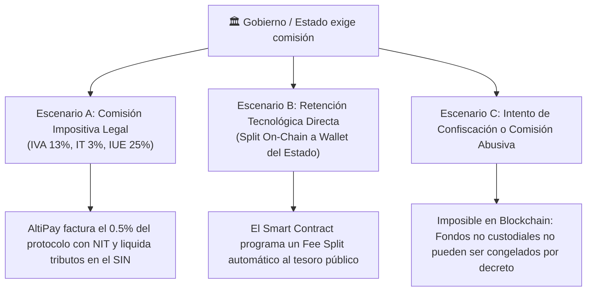

# ⚖️ AltiPay Protocol — Sustentación Legal en Bolivia y Marco Tributario

> **Documento:** Marco Regulatorio, Sustentación Jurídica y Análisis Tributario  
> **Jurisdicción:** Estado Plurinacional de Bolivia  
> **Fecha:** Septiembre 2026  
> **Clasificación:** Regulatorio / Compliance / Legal Engineering  

---

## 1. 📌 Resumen Ejecutivo

Este documento fundamenta la **validez jurídica, contractual y regulatoria** de **AltiPay Protocol** en el Estado Plurinacional de Bolivia, así como la respuesta técnica y legal ante escenarios donde el **Gobierno o el Servicio de Impuestos Nacionales (SIN)** exija comisiones, alícuotas o retenciones impositivas.

El análisis se estructura en dos grandes ejes:
1. **Sustentación Legal Positiva:** Normas del ordenamiento jurídico boliviano que respaldan y dan validez a los contratos inteligentes de custodia comercial (*escrow*) con activos virtuales.
2. **Escenario de Comisión o Tributación Estatal:** Análisis de qué ocurre si el Estado exige participación en las transacciones, cómo lo asimila la arquitectura del smart contract y los límites de la intervención pública frente a protocolos no custodiales.

---

## 2. 🏛️ Sustentación Legal en el Ordenamiento Jurídico Boliviano

```
┌────────────────────────────────────────────────────────────────────────────────────────┐
│                        COLUMNAS DEL MARCO LEGAL BOLIVIANO                              │
│                                                                                        │
│  [BCB R.D. 082/2024]      [Ley 164 - TICs]       [Código Civil y Comercio]  [Ley 393]  │
│   Apertura y licitud       Validez jurídica de    Autonomía contractual y   No somos   │
│   de activos virtuales     firmas criptográficas  compraventa condicional   un banco   │
└────────────────────────────────────────────────────────────────────────────────────────┘
```

---

### 2.1 Resolución de Directorio N° 082/2024 del Banco Central de Bolivia (BCB)
*Fecha de emisión: 25 de junio de 2024*

* **El Hito Histórico:** El BCB abrogó formalmente la Resolución de Directorio N° 144/2020 (que restringía el uso de criptoactivos e instrumentos virtuales en el sistema de pagos).
* **Fundamento para AltiPay:**
  * La **R.D. 082/2024 habilita expresamente las operaciones y transacciones con Activos Virtuales** a través de canales e instrumentos electrónicos de pago.
  * Si bien ratifica que el Boliviano (BOB) es la única moneda de curso legal (con poder liberatorio obligatorio), **reconoce la licitud civil y comercial de poseer, transferir y utilizar activos virtuales y stablecoins (como USDC) en transacciones entre privados**.
  * La circular coordinada con la **ASFI (Autoridad de Supervisión del Sistema Financiero)** establece un régimen de transparencia y educación financiera para el ecosistema cripto en Bolivia.

---

### 2.2 Ley N° 164 — Ley General de Telecomunicaciones, Tecnologías de Información y Comunicación
*Promulgada el 8 de agosto de 2011*

AltiPay basa toda su interacción (firmas de wallets, hashes de liberación y confirmaciones de PIN) en el principio de **equivalencia funcional** consagrado en esta ley:

* **Artículo 6 (Definiciones):** Reconoce expresamente los *mensajes de datos*, *documentos digitales*, *firma digital* y *comercio electrónico*.
* **Artículo 78 (Validez Jurídica de los Documentos Digitales):**
  > *"Los actos y contratos celebrados por medio de documentos digitales tendrán la misma validez y eficacia probatoria que los celebrados por medios escritos."*
* **Artículo 79 (Firma Digital):** La firma de transacciones en la blockchain mediante criptografía asimétrica de curva elíptica (ECDSA secp256k1) vincula inequívocamente al titular de la llave privada con la instrucción de depósito, despacho o liberación.
* **Artículo 80 y 81 (Comercio Electrónico y Protección de Mensajes):** Ampara los acuerdos comerciales pactados por medios electrónicos y garantiza que no se negará validez jurídica a un contrato por el solo hecho de haberse originado en un mensaje de datos o código informático.

---

### 2.3 Código Civil Boliviano (Decreto Ley N° 12760)

* **Artículo 452 (Requisitos para la formación del contrato):**
  1. Consentimiento de las partes.
  2. Objeto.
  3. Causa.
  4. Forma (siempre que la ley la exija).
  En AltiPay, el consentimiento se perfecciona cuando el comprador deposita el capital en el contrato y el vendedor acepta los términos del pedido.
* **Artículo 454 (Libertad Contractual y Autonomía de la Voluntad):**
  > *"Las partes pueden determinar libremente el contenido de los contratos que celebren y acordar contratos diferentes de los comprendidos en este Código (contratos atípicos o innominados), en los límites impuestos por la ley y la realización de intereses dignos de tutela jurídica."*
  El contrato de **Smart Escrow** es un contrato atípico de custodia en garantía plenamente tutelado por la autonomía de la voluntad.
* **Artículos 494 y 589 (Contratos bajo Condición Suspensiva):**
  La compraventa mercantil entre La Paz, Cochabamba y Santa Cruz se perfecciona bajo condición suspensiva: **el precio no se transfiere al patrimonio del vendedor hasta que se cumpla el hecho futuro e incierto** (la recepción física e inspección del bulto mediante la guía de transporte).
* **Artículo 838 y ss. (Depósito y Custodia):** Regula el depósito de bienes fungibles condicionado a la entrega a favor de un tercero o cumplimiento de una obligación previa.

---

### 2.4 Código de Comercio de Bolivia (Decreto Ley N° 14379)

* **Artículo 803 (Buena Fe Comercial y Pacta Sunt Servanda):** Los contratos mercantiles deben ejecutarse según los dictados de la buena fe y la estricta correspondencia entre las prestaciones acordadas.
* **Artículos 927 al 971 (Contrato de Transporte de Cosas y Encomiendas):**
  * La **Carta de Porte / Guía de Carga** expedida por las flotas interdepartamentales terrestres (Flota Bolívar, Trans Copacabana, El Dorado) constituye el documento mercantil probatorio de recepción y entrega de la mercadería.
  * AltiPay vincula directamente la metadata de la guía física de encomienda (`trackingNumber`, `transportCompany`, `dispatchDate`) con el estado on-chain del escrow.

---

### 2.5 Ley N° 393 de Servicios Financieros (Delimitación de la Actividad)
*¿Por qué AltiPay NO requiere licencia bancaria de la ASFI?*

* **Artículo 6 (Intermediación Financiera):** La ley define intermediación financiera como la *captación habitual de recursos del público en forma de depósitos o préstamos para su posterior colocación en créditos e inversiones por cuenta y riesgo propio*.
* **AltiPay es un protocolo NO CUSTODIAL (*Non-Custodial Protocol*):**
  * No capta depósitos en balance corporativo.
  * No utiliza el dinero depositado para prestarlo a terceros ni generar rentabilidad especulativa.
  * No posee la custodia ni las llaves privadas de los usuarios.
  * Los fondos se depositan en una dirección de contrato inteligente inmutable y autónoma, donde las condiciones de entrada y salida son matemáticas y automáticas.
  * Por tanto, opera como una **herramienta tecnológica de software / procesamiento de datos**, no como un intermediario financiero tradicional.

---

### 2.6 Prevención de Legitimación de Ganancias Ilícitas (UIF / Ley N° 004)
* **Transparencia vs. Informalidad del Efectivo:**
  El comercio tradicional de flotas moviliza mochilas con miles de dólares o bolivianos en efectivo, un método 100% anónimo, riesgoso e imposible de auditar.
* **Trazabilidad On-Chain:**
  En AltiPay, cada operación queda registrada de forma permanente e indeleble en una blockchain pública (Avalanche / HashKey):
  * Dirección de wallet de origen y destino.
  * Monto exacto, token y hora exacta de la transacción (*timestamp*).
  * Hash de la transacción y documento de transporte.
  Esto otorga una **trazabilidad forense superior** a cualquier operación en efectivo, alineándose con las directrices del GAFI (Grupo de Acción Financiera Internacional) y la UIF Bolivia.

---

## 3. 💸 ¿Qué pasaría si el Gobierno quiere una comisión?

Si el Estado boliviano (Servicio de Impuestos Nacionales - SIN, Ministerio de Economía o Aduana) decide exigir una alícuota, comisión o retención sobre las operaciones de AltiPay, el impacto se analiza en **tres escenarios concretos**:



---

### Escenario A: Régimen Impositivo Formal (El camino ordinario de la Ley Tributaria)

Si AltiPay opera formalmente con personería jurídica en Bolivia (como empresa fintech o de base tecnológica):

1. **La Comisión de Protocolo (0.50%):**
   * El protocolo cobra una comisión técnica por el uso del software (definida en `feeBps = 50` en el contrato `AltiPayEscrow.sol`).
   * Por cada transacción de $1,000 USDC, AltiPay retiene $5 USDC de comisión de servicio.
2. **Tratamiento Tributario ante el SIN:**
   * **Impuesto a las Transacciones (IT - 3%):** Se liquida mensualmente sobre el total de comisiones percibidas en software.
   * **Impuesto al Valor Agregado (IVA - 13%):** Se emite factura electrónica digital autorizada por el SIAT (Sistema Integrado de la Administración Tributaria) del SIN por el servicio de custodia tecnológica.
   * **Impuesto sobre las Utilidades de las Empresas (IUE - 25%):** Sobre la utilidad neta de la empresa operadora al cierre de gestión.
3. **Mecanismo Operativo:**
   * Los USDC acumulados en la billetera de tesorería (`treasury`) se monetizan periódicamente a bolivianos (BOB) mediante intermediarios autorizados y se declaran en los formularios oficiales (Form. 200 IVA, Form. 400 IT, Form. 500 IUE).

---

### Escenario B: Exigencia de Comisión o Retención Directa On-Chain (Regulación Fintech Avanzada)

Si el gobierno o la ASFI emitiera una normativa que exija una **tasa de supervisión digital** o una **retención impositiva en la fuente** sobre pagos digitales:

1. **Adaptabilidad de la Arquitectura del Smart Contract:**
   El contrato `AltiPayEscrow.sol` ya está diseñado con parámetros modulares:
   ```solidity
   // Estructura de retención y liquidación
   uint256 public feeBps = 50; // 0.50%
   address public treasury;     // Dirección de recaudación
   ```
2. **Implementación de un "Fee Splitter" Fiscal:**
   Si la ley estipula una retención del 1% para el Estado:
   * Se actualiza la función de liquidación para que al momento de liberar los fondos (`confirmDelivery`):
     $$\text{Total Fee} = \text{Fee Protocolo} + \text{Tasa Estatal}$$
   * El contrato transfiere automáticamente la porción correspondiente a la dirección pública designada por el Banco Central de Bolivia o el Ministerio de Economía, sin intervención humana ni retrasos burocráticos.
3. **Ventaja para el Estado:**
   * Recaudación instantánea en dólares digitales auditables.
   * Cero evasión: la matemática del contrato garantiza que nadie puede evadir la retención al momento de completar la compraventa.

---

### Escenario C: ¿Qué pasa si el Gobierno intenta confiscar los fondos o cobrar una comisión abusiva?

Si un gobierno intentara intervenir, congelar las cuentas o imponer comisiones expropiatorias:

1. **Inviolabilidad Criptográfica (No Custodial):**
   * En un banco tradicional, un juez o la ASFI envía un oficio de congelamiento de cuentas y el banco bloquea los fondos del comerciante en minutos.
   * En **AltiPay**, los fondos están depositados en un contrato autónomo en una blockchain descentralizada global (Avalanche / Ethereum / HashKey).
   * **Ni el equipo creador de AltiPay, ni un juez, ni el gobierno tienen la llave privada para sustraer los fondos de un escrow activo.**
   * La única forma de que el dinero salga del contrato es que:
     * El comprador ingrese el PIN hash de entrega física (`confirmDelivery`).
     * O venza el plazo máximo pactado y el comprador solicite el reembolso legal (`refundAfterDeadline`).
     * O ambas partes acuerden una resolución de disputa.
2. **Resistencia a la Censura:**
   * El código del contrato inteligente es inmutable una vez desplegado y verificado en la blockchain.
   * Ningún decreto administrativo puede alterar el código compilado en la red descentralizada.
3. **El Punto de Control del Estado (Rampas Fiat):**
   * Donde el gobierno sí tiene potestad es en el **sistema bancario nacional** (cuentas en bolivianos de los comerciantes que usan transferencias QR o P2P).
   * Por esta razón, la mejor estrategia para AltiPay no es la confrontación ni la clandestinidad, sino **operar en total armonía con la R.D. 082/2024 del BCB**, tributar transparentemente las comisiones del protocolo y posicionarse como la solución que formaliza y protege el comercio boliviano.

---

## 4. 📊 Matriz Comparativa: Sistema Tradicional vs. AltiPay ante el Estado

| Dimensión | Sistema Tradicional (Mochilas de Cash / Flotas) | AltiPay Protocol (Web3 PayFi) |
| :--- | :--- | :--- |
| **Moneda utilizada** | Billetes físicos (dólares o bolivianos) | Dólares digitales (USDC en blockchain) |
| **Respaldo Legal** | Código de Comercio (Recibos informales) | Ley 164, Código Civil, R.D. 082/2024 BCB |
| **Riesgo de Confiscación** | Alto (Robos en ruta, requisas, extorsión) | Cero (Protección por criptografía no custodial) |
| **Capacidad de Fiscalización** | Opaca / Informal (Sin registro auditable) | Transparente (Trazabilidad on-chain auditable) |
| **Tratamiento Tributario** | Evasión masiva por uso de efectivo | Facturación formal del fee de servicio (IVA/IT) |
| **Adaptabilidad a Tasas Estatales**| Inviable / Incontrolable | Programable mediante *Smart Contract Splitter* |

---

## 5. 🎯 Conclusión Institucional para Presentación a Inversionistas y Jueces

> *"AltiPay opera dentro del marco de la **R.D. 082/2024 del BCB** y la **Ley 164 de Telecomunicaciones**, transformando un comercio informal de alto riesgo en un ecosistema de pagos programables transparente y auditable. Si el Estado boliviano establece gravámenes o tasas de regulación, el protocolo cuenta con la **arquitectura matemática para tributar como proveedor de software o ejecutar retenciones automáticas on-chain**, manteniendo al mismo tiempo la **inviolabilidad no custodial de los ahorros y mercaderías de los comerciantes bolivianos**."*
