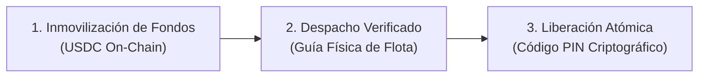
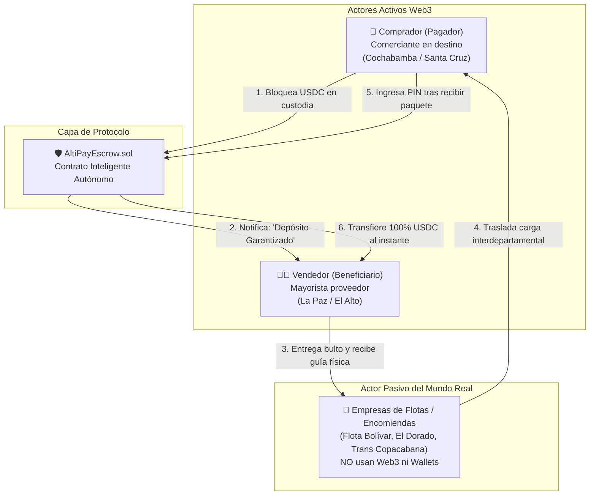
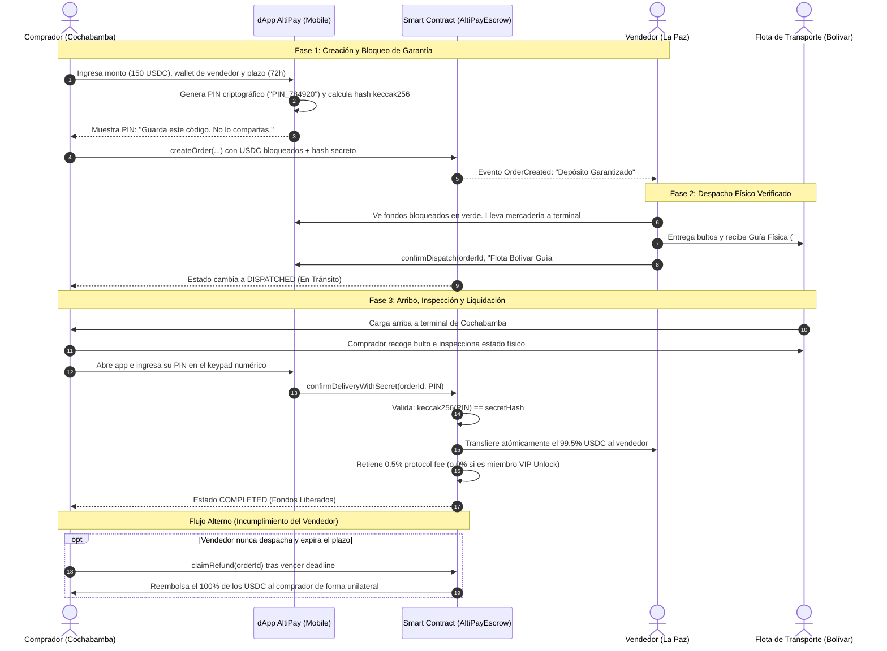

# 📑 AltiPay Protocol — Tesis de Producto, Arquitectura de Negocio y Modelo Financiero

> **Documento:** Institutional Product & Business Whitepaper  
> **Versión:** 1.0.0 — Executive Edition  
> **Fecha:** Septiembre 2026  
> **Track:** Real-World Ethereum Applications para Economías Emergentes (Devfolio / EAG Global)  
> **Autoría:** Equipo de Ingeniería y Producto AltiPay Protocol

---

## 1. 📌 Resumen Ejecutivo (Executive Summary)

**AltiPay Protocol** es una infraestructura financiera descentralizada de pagos condicionales (**PayFi — Payment Finance**) diseñada para erradicar la **asimetría de desconfianza** en el comercio mayorista interdepartamental de economías emergentes, tomando como mercado ancla el corredor logístico de Bolivia (**La Paz ↔ Cochabamba ↔ Santa Cruz**).

AltiPay transforma el despacho tradicional de encomiendas terrestres mediante un **motor de custodia fiduciaria algorítmica (*smart escrow*)** no custodial. Inmoviliza el capital del comprador en dólares digitales (**USDC**) y **subordina la liquidación atómica del 100% de los fondos a la verificación física de la entrega**, validada criptográficamente mediante una prueba secreta (*hash pre-image*) contenida en la guía de transporte.

```
┌────────────────────────────────────────────────────────────────────────────────────────┐
│                                   LA TESIS DE ALTIPAY                                  │
│                                                                                        │
│   "Reemplazar el arbitraje humano costoso y la desconfianza del comercio informal       │
│    por un contrato inteligente imparcial, atando el flujo del dinero on-chain a la     │
│    entrega física de la encomienda en el mundo real, sin intermediarios bancarios."    │
└────────────────────────────────────────────────────────────────────────────────────────┘
```

---

## 2. 🎯 Planteamiento del Problema: La Fricción del Mundo Real

### 2.1 El Dilema de Desconfianza Bilateral
En economías emergentes donde el comercio mayorista informal representa más del **65% del PIB comercial**, los comerciantes que compran y venden insumos, repuestos automotrices, textiles y tecnología entre ciudades distantes se enfrentan a un callejón sin salida teórico (el *Dilema del Prisionero*):

```
       ┌────────────────────────────────────────────────────────┐
       │   Comprador (Cochabamba)       Vendedor (La Paz)       │
       ├───────────────────────────┬────────────────────────────┤
       │ "¿Cómo te voy a transferir│ "No voy a dejar la carga   │
       │  por adelantado si no sé  │  en la flota si no tengo la│
       │  si vas a enviar el bulto │  plata segura en mi mano." │
       │  o si me vas a estafar?"  │                            │
       └───────────────────────────┴────────────────────────────┘
                                   │
                                   ▼
                    ESTANCAMIENTO O RIESGO DE FRAUDE
```

### 2.2 Fricciones Macroeconómicas y Estructurales en Bolivia
1. **Riesgo Físico y Dependencia del Efectivo:**  
   Para cerrar tratos sin estafas, muchos comerciantes se ven forzados a viajar 8 a 15 horas en flota transportando mochilas con miles de dólares o bolivianos en efectivo, exponiéndose a robos en terminales y carreteras.
2. **Crisis de Divisas y Devaluación Acelerada:**  
   En Bolivia existe una marcada brecha entre el tipo de cambio oficial y el mercado paralelo de divisas, sumado a restricciones bancarias para retirar dólares. El crédito comercial tradicional en moneda local sufre pérdida de poder adquisitivo durante los 3 a 5 días que toma el transporte terrestre.
3. **Inoperancia Legal en el Segmento Informal:**  
   Si una de las partes incumple, demandar judicialmente por una factura o recibo informal de $2,000 USD es financieramente inviable: el costo de abogados y el tiempo burocrático superan el monto disputado.

---

## 3. 💡 La Propuesta de Valor: ¿Qué propone AltiPay?

AltiPay propone una **Capa de Liquidación Programable y Descentralizada (Settlement Layer)** que elimina el riesgo bilateral mediante tres pilares:



1. **Garantía Inmutable On-Chain:** El comprador deposita USDC. El contrato inteligente bloquea los fondos; ni el comprador puede retirarlos arbitrariamente antes del plazo, ni el vendedor puede cobrarlos antes de entregar.
2. **Neutralidad Tecnológica Absoluta:** Los fondos no pertenecen a una empresa privada, a un banco ni a los creadores de AltiPay; residen en un contrato inmutable auditable en blockchain.
3. **Validación Criptográfica con el Mundo Físico:** La llave que libera el dinero es un código secreto (`PIN`) que solo se materializa cuando el comprador inspecciona el bulto en la oficina de destino de la flota de transporte.
4. **Protección Unilateral contra Incumplimientos (Auto-Refund):** Si el vendedor jamás despacha o incumple el plazo pactado (*deadline*), el comprador recupera el 100% de su capital de forma automática sin burocracia bancaria.

---

## 4. 👥 Mapeo de Actores del Ecosistema

AltiPay está diseñado con un principio de **asimetría tecnológica inteligente**: los actores no necesitan el mismo nivel de conocimiento técnico para participar.



### Detalle de Responsabilidades por Actor:

| Actor | Perfil y Realidad Operativa | Rol en AltiPay | Nivel Técnico Requerido |
|---|---|---|---|
| **1. El Comprador (Pagador)** | Dueño de tienda, taller o distribuidor local (ej. en La Cancha, Cbba). Desea comprar sin riesgo de perder su dinero por adelantado. | Genera la orden, fondea los dólares digitales (USDC), custodia el PIN secreto y lo introduce al verificar la mercadería. | **Básico:** Interfaz web mobile en español con botones intuitivos y keypad táctil. |
| **2. El Vendedor (Beneficiario)** | Importador mayorista en La Paz (ej. Eloy Salmón o Uyustus). Exige certeza de pago antes de despachar mercadería de alto valor. | Monitorea su panel, verifica el badge verde *"Depósito Garantizado"* y registra el número de guía de transporte. | **Básico:** Consulta visual del estado de pago en el navegador de su teléfono. |
| **3. Las Flotas (Actor Pasivo)** | Empresas de buses interdepartamentales (Flota Bolívar, Trans Copacabana, etc.). Cuentan con mostradores físicos de encomiendas. | **Ninguno directo.** Actúan como medio portador del dato secreto (número de guía/factura de equipaje). **No tocan cripto ni necesitan wallets.** | **Cero:** Operan su logística exactamente igual que hoy en día. |
| **4. El Protocolo AltiPay** | Código autónomo desplegado en EVM (HSK Testnet / Avalanche). | Árbitro neutral incorruptible. Custodia los fondos, descuenta fees y ejecuta liquidaciones o reembolsos según reglas matemáticas. | **Autónomo.** Sin intervención de personal humano. |

---

## 5. 🔄 Flujo Operativo Paso a Paso (End-to-End)



---

## 6. ⚖️ Análisis Competitivo y Moat Estratégico

AltiPay no compite contra las billeteras existentes; compite contra la **desconfianza y el riesgo de crédito informal**.

| Criterio Clave | **AltiPay Protocol** | Bancos Tradicionales & Billeteras Fiat (Yape, Tigo Money, QR BCP) | Billeteras Cripto Estándar (MetaMask, Trust, Binance P2P) | Cartas de Crédito Bancarias Tradicionales |
|:---|:---:|:---:|:---:|:---:|
| **Mecanismo de Pago** | **Condicional (Escrow)** | Inmediato e irreversible | Inmediato e irreversible | Condicional documental |
| **Riesgo de Estafa de Contraparte** | **0% (Matemático)** | Alto (si pagas primero y no envían, perdiste) | Crítico (sin posibilidad de chargeback) | Muy bajo |
| **Protección contra Devaluación** | **Total (USDC/Stablecoins)** | Nula (Moneda local en pérdida de poder adquisitivo) | Total (Stablecoins) | Alta (pero con costos fiduciarios) |
| **Costo por Transacción** | **0.50% (o 0% VIP)** | Comisiones bancarias o transferencias interbancarias | Solo gas de red | **2% a 5% + gastos notariales** |
| **Tiempo de Liquidación** | **Instantáneo (al dar PIN)** | Sujeto a horarios bancarios / límites diarios | Instantáneo | **15 a 45 días de burocracia** |
| **Reembolso por Incumplimiento** | **Automático por Timeout** | Requiere denuncias judiciales o reclamos | Inexistente | Burocrático y litigioso |
| **Fricción para la Empresa de Flotas** | **Cero (Actor Pasivo)** | No aplica | No aplica | Requiere validación de aduanas/agentes |

### 🛡️ Los 4 Diferenciadores Clave (*The Moat*):
1. **Atadura Cripto-Física:** La blockchain no sabe qué pasa en el mundo real salvo que uses oráculos costosos. AltiPay resuelve el "problema del oráculo" empoderando al comprador como validador final mediante una preimagen criptográfica (`keccak256`).
2. **Arquitectura Zero-Friction para Transportistas:** Si forzáramos a los choferes de flotas a instalar billeteras Web3, el producto fracasaría el día 1. AltiPay convierte la guía de papel existente en el portador del estado.
3. **Escudo Anti-Devaluación:** En mercados con crisis cambiaria (como Bolivia, Argentina o Venezuela), comerciar en USDC protege el margen operativo del importador frente al dólar blue/paralelo.
4. **Token-Gated PayFi con Unlock Protocol:** Introduce incentivos comerciales reales: comerciantes de alto volumen adquieren un NFT "VIP Key" y acceden a una estructura de comisiones del 0%, generando retención y lealtad.

---

## 7. 💰 Modelo de Negocio, Monetización y Rentabilidad

AltiPay opera como un protocolo de infraestructura con un modelo de **Take-Rate Transaccional + Suscripciones PayFi**.

### 7.1 Fuentes de Ingreso (Revenue Streams)

```
┌────────────────────────────────────────────────────────────────────────────────────────┐
│                                MODELO DE INGRESOS ALTIPAY                              │
│                                                                                        │
│   1. TAKE RATE BASE (0.50% por transacción completada):                                │
│      Deducido automáticamente del monto liquidado al vendedor.                         │
│                                                                                        │
│   2. MEMBRESÍAS VIP TOKEN-GATED (Unlock Protocol):                                     │
│      Venta de pases NFT semestrales/anuales para comerciantes frecuentes con 0% fee.   │
│                                                                                        │
│   3. API B2B & SDK EMPRESARIAL (Post-MVP):                                             │
│      Cobro a empresas de flotas y courier por integración a sus sistemas ERP.          │
└────────────────────────────────────────────────────────────────────────────────────────┘
```

### 7.2 Dimensionamiento del Mercado (TAM - SAM - SOM)

* **TAM (Total Addressable Market — Comercio Mayorista Bolivia):**  
  Se estima un movimiento de **$1,200 millones de USD anuales** en transacciones interdepartamentales terrestres de mercaderías e insumos en el eje troncal (La Paz, Santa Cruz, Cochabamba, Oruro).
* **SAM (Serviceable Available Market — Corredor Eje Troncal de Encomiendas):**  
  Mercancía transportada vía encomiendas comerciales en flotas formales e intermedias: **$240 millones de USD anuales**.
* **SOM (Serviceable Obtainable Market — Año 1-2 Piloto):**  
  Capturar el **2% del corredor La Paz ➔ Cochabamba** (comerciantes mayoristas de La Cancha y Eloy Salmón):  
  **$4.8 millones de USD en volumen transaccionado (GMV)**.

### 7.3 Proyección de Rentabilidad y Unit Economics

Debido a su diseño **backend-less en blockchain**, AltiPay tiene una estructura de costos operativos ridículamente baja (no requiere servidores de base de datos costosos, ni balanceadores, ni custodia bancaria):

#### Análisis de Margen Unitario por Orden Promedio ($500 USD):
* **Valor de Orden Promedio (AOV):** $500.00 USDC
* **Comisión AltiPay (0.50%):** $2.50 USDC
* **Costo de Gas On-Chain (asumido por el usuario o patrocinado en L2/L3):** ~$0.01 - $0.05 USD
* **Margen Bruto:** **>96% por transacción**

#### Escenarios de Escalabilidad Financiera:

| Escenario | Volumen Mensual (GMV) | Órdenes / Mes (AOV $500) | Ingreso por Fee (0.5%) | Ingreso por VIP Passes | Ingreso Mensual Estimado |
|---|:---:|:---:|:---:|:---:|:---:|
| **Piloto (Mes 1 - 3)** | $100,000 USDC | 200 órdenes | $500 USDC | $300 USDC | **$800 USD/mes** |
| **Tracción (Mes 4 - 8)** | $1,000,000 USDC | 2,000 órdenes | $5,000 USDC | $1,500 USDC | **$6,500 USD/mes** |
| **Expansión (Año 2)** | $5,000,000 USDC | 10,000 órdenes | $25,000 USDC | $6,000 USDC | **$31,000 USD/mes** |

> 📌 **Viabilidad:** Con solo 2,000 órdenes mensuales en el corredor de La Cancha (Cochabamba), el protocolo genera **$78,000 USD anuales** de flujo de caja con costos de mantenimiento técnico prácticamente nulos.

---

## 8. 🛡️ Matriz de Riesgos y Mitigaciones Técnicas

| Riesgo Planteado | Impacto | Mecanismo de Mitigación en AltiPay |
|---|:---:|---|
| **¿Qué pasa si el comprador recibe la carga pero rehúsa ingresar el PIN?** | Medio | Al crear la orden se define un `deadline` razonable (ej. 72h). Si el vendedor cargó la guía verificable de la flota, el protocolo implementará en Fase 2 un arbitraje comunitario multipartito descentralizado (Kleros o árbitro local) con penalización de colateral de reputación. |
| **¿Qué pasa si el paquete llega destruido o con mercadería equivocada?** | Medio | El comprador **no ingresa el PIN**. Al no ingresarlo, el vendedor no cobra. Ambas partes son forzadas a negociar un acuerdo o cancelación consensuada antes de que expire el plazo. |
| **¿Qué pasa si la flota de transporte sufre un accidente o robo en carretera?** | Bajo | La encomienda física cuenta con el seguro tradicional de la guía de la flota. En AltiPay, el dinero sigue seguro en el smart contract; el comprador no sufre la pérdida directa del capital pagado a ciegas. |
| **¿Qué pasa si el vendedor nunca envía la mercadería?** | Nulo | El comprador simplemente espera a que expire el `deadline` y ejecuta `claimRefund()` unilateralmente para retirar el 100% de su dinero. |

---

## 9. 🗺️ Estrategia Go-To-Market (GTM)

### Fase 1: Infiltración en Mercados Tradicionales (Mes 1 - 3)
* **Puntos de Contacto Físicos:** Promotores en las terminales de buses de **Cochabamba (Av. Ayacucho)** y **La Paz (Terminal Central)**.
* **Onboarding asistido:** Enseñar a los comerciantes de La Cancha a abrir su cuenta y fondearla en 2 minutos.
* **Subsidio de Gas Inicial:** Patrocinio del gas en HSK Chain / Avalanche Fuji para que las primeras 500 operaciones tengan costo cero de red.

### Fase 2: Alianzas con Agencias de Encomiendas (Mes 4 - 8)
* Acuerdos con **Flota Bolívar** y **El Dorado**: imprimir en el reverso de las guías de encomienda el sello:  
  *"Garantizado con AltiPay Protocol — Escrow Digital"*.
* Integración de QR directo en el boleto de encomienda.

### Fase 3: Expansión Transfronteriza (Mes 9 - 18)
* Replicar el modelo en corredores de comercio informal andino de alta fricción:
  * **Desaguadero (Frontera Bolivia ↔ Perú)**
  * **Yacuiba / Bermejo (Frontera Bolivia ↔ Argentina)**

---

## 10. 🏆 Conclusión Institucional

**AltiPay Protocol no es un experimento teórico de finanzas especulativas:** es una herramienta de **economía real** que aborda una falla de mercado crítica en América Latina.

Al utilizar contratos inteligentes como fideicomisarios incorruptibles y liquidar en dólares digitales estables (USDC), AltiPay otorga a los comerciantes informales el mismo nivel de seguridad jurídica y bancaria que tienen las grandes corporaciones transnacionales con cartas de crédito, pero a una fracción del costo y a la velocidad de un clic en el teléfono móvil.
